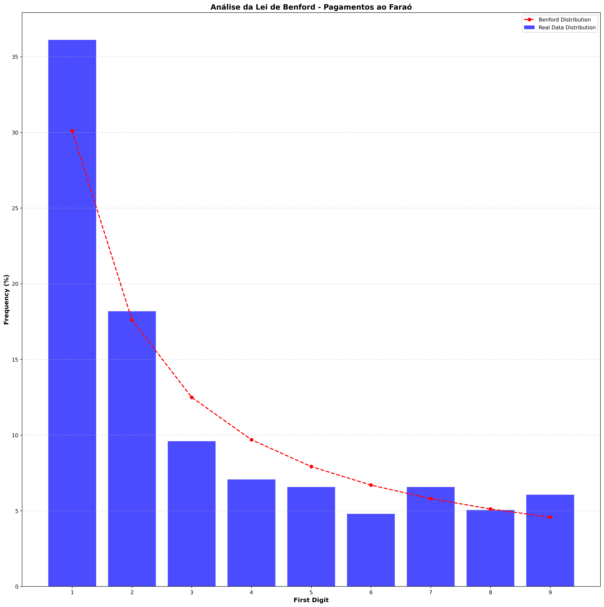

# Bitcoin Forensic Analysis: "Faraó do Bitcoin"

This repository contains an academic forensic analysis project focused on the Brazilian cryptocurrency pyramid scheme known as "Faraó do Bitcoin". The project was developed for the Special Topics in Security: Blockchain (and Bitcoin) course.

The main goal of this script is to track, analyze, and cluster the depositors who sent funds to a specific target address (`1JHH1pmHujcVa1aXjRrA13BJ13iCfgfBqj`) associated with the scheme.

## 🔍 Features

* **Data Fetching & Caching:** Retrieves transaction data using the Blockchair API and caches it locally (in `./cache/`) to minimize API requests and save costs.
* **Address Clustering:** Implements clustering heuristics to group addresses belonging to the same entity:
  * **H1 (Multiple-Input):** Assumes all inputs in a single transaction belong to the same entity.
  * **H2 (Change Address):** Identifies change addresses by evaluating the transaction outputs against specific rules (e.g., first appearance, value strictly lower than the smallest input UTXO).
* **Financial Statistics:** Calculates total volume, mean, min, max, and the Gini coefficient to evaluate wealth distribution among depositors.
* **Data Visualization:** Plots the financial distribution against Benford's Law and generates a Directed Graph showing the flow of funds from the identified clusters to the target address.

## 📊 Visualizations

### Benford's Law Analysis


### Entity Clustering Graph (H1 & H2)


## ⚙️ Installation

1. Clone this repository:
```bash
git clone [https://github.com/your-username/farao-btc.git](https://github.com/your-username/farao-btc.git)
cd farao-btc
```
2. Create and activate a virtual environment (recommended):
```bash
python -m venv venv
# On Linux/macOS
source venv/bin/activate
# On Windows
venv\Scripts\activate
```
3. Install the required dependencies:
```bash
pip install -r requirements.txt
```

## 🔑 Configuration
This project uses the Blockchair API to fetch blockchain data. You need to provide your API key to run the script.

1. Create a .env file in the root directory.

2. Add your Blockchair API key to the file:
```bash
BLOCKCHAIR_APIKEY=your_api_key_here
```


## 🚀 Usage
Run the main script to fetch the data, perform the clustering, calculate the statistics, and generate the graphs:

```bash
python main.py
```
*Note: The generated graphs (benford_farao.png and grafo_farao.png) will be saved in the root directory.*

## 📚 Disclaimer
This project was developed strictly for academic and educational purposes.
